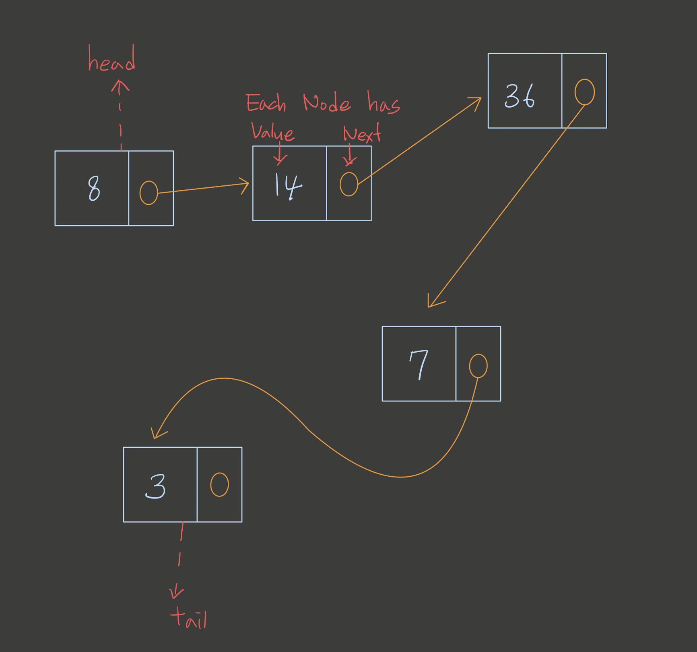

# Linked List

- Linked List는 그 크기가 동적인 자료구조로서, _Node_ 의 연결로 이루어진 자료구조이다.
- Linked List는 Array와 비슷한 구조를 갖지만 내부적으로나 기능적으로 Array와 큰 차이를 갖은 구조이다.
- Linked List 는 한방향으로만 접근이 되는 Singly-Linked List와 양방향 접근이 되는 Doubly-Linked List 가 있다.
- Linked List는 Node들의 연결에서 제일 앞에 있는 `head`와 `tail`값을 갖고 각 Node는 자기자신과 또 자신과 연결되어 있는 Node의 값을 갖는다.
- Linked List는 Array처럼 index값을 갖고 있지 않기 때문에 어떤 data에 접근하기 위해서는 head 기준으로 하나씩 다음 노드로 넘어가면서 확인하며 접근한다.
- Linked List 중간에 node data를 삽입하거나 삭제가 가능하다.
- Big-O Notation 기준으로 가져오기:O(n), 추가하기:O(1), 삭제하기:O(1) 의 시간복잡도를 갖는다.

## How Linked List Works



- 각각의 노드는 컴퓨터 메모리상에서 흩뿌려져있는 데이타들이다. 그 노드들을 모아서 연결한것이 Linked List이다. Array와 같이 나란히 붙어서 저장되는 자료구조와는 차이점이 있다. (Linked List도 물론 메모리상에서 나란히 저장 **_될 수도_** 있다.)
- 각각의 노드는 자신노드 다음 노드를 바로보고 있다.
- Head Node에 접근할 수 없다면 그 Linked List는 없는것이나 마찬가지다. 이렇게 노드는 존재하지만 연결성을 잃어버림으로서 그 data는 존재하지 않는다고 볼 수 있다. (이런 data들은 garbage collector에 의해서 지워진다.)
- 따라서 data를 원하는 위치에 추가 하려면 그 data를 갖고 있는 Node가 어떤 Node의 Next값이 되고 자신의 Next로서 다른 Node를 바라보게 한다.
- 삭제를 하려면 삭제하려는 Node를 바라보고 있는 Node의 Next를 기존에 자기가 바라보던 Next Node로 재할당한다.

## Sinlgy-Linked List 코드로 구현하기

```
class Node {
  constructor(value) {
    this.value = value;
    this.next = null;
  }
}

class LinkedList {
  constructor() {
    this.head = null;
    this.tail = null;
    this._size = 0;
  }
    addToTail(value) {
    if (this._size === 0) {
      this.head = new Node(value)
      this._size++
    } else if (this._size === 1) {
      this.tail = new Node(value)
      this.head.next = this.tail
      this._size++
    } else {
      let temp1 = this.tail
      temp1.next = new Node(value)
      this.tail = temp1.next
      this._size++
    }
  }

  remove(value) {

    // case1 ==> head 를 지울 때
    // --> head 는 head.next 값이 되야 한다.
    // --> head.next 값이 이전에 tail값이라면 tail node를
    //     head로 만들고 this.tail=null 이 되야 한다.
    let indx = 1
    let previous = this.head
    if (value === this.head.value) {
      this.head = this.head.next
      this._size--
      //case1-1 ==> tail 노드가 head 가 되었을 때
      if (this.head === this.tail) {
        this.tail = null
        return
      }
    } else {
       //case2 ==> head 가 아닌 노드를 지울 때
       while (indx < this._size-1) {
        if(previous.next.value === value) {
          previous.next = previous.next.next
          this._size--
        } else {
          previous = previous.next
          indx++
        }
      }
    }
    // case3 ==> tail 을 지울 때
    if (this.tail.value === value) {
      previous.next = null
      this.tail = previous
      this._size--
      if (this.tail === this.head) {
        this.tail = null
      }
    }
  }

  getNodeAt(index) {
    let indx = 0
    let cur = this.head
    if (index > this._size-1) {
      return undefined
    }
    while (indx !== index)
      cur = cur.next
      indx++
    }
    return cur
  }

  contains(value) {
    let cur = this.head
    for (let i = 0; i<this._size; i++) {
      if (cur.value === value) {
        return true
      } else {
        cur = cur.next
      }
    }
    return false
  }

  indexOf(value) {
    let current = this.head
    for (let i = 0; i<this._size; i++) {
      if (current.value === value) {
        return i
      } else {
        current = current.next
      }
    }
    return -1
  }

  size() {
    return this._size
  }

```
