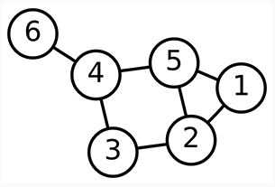
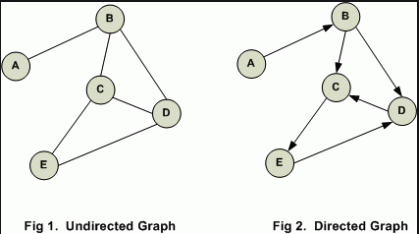

# 🔎 Graph

- graph는 Node(_또는 Vertex 라고도 부른다_)들의 연결로서 이루어진 자료구조이다.
- graph에서 모든 node는 하나 이상의 다른 node와 연결되어 있다.
- graph는 Node를 서로 연결하는 edge로 구성되고 edge의 방향성에 따라서 **undirected graph** or **directed graph** 로 구분된다. undirected 는 어떤 node에서 다른 node로 한 방향으로만 연결된 비대칭 edge가 있는 graph이고 undirected는 모든 node가 자신과 연결된 node에 대해서는 양방향을 서로 바라봄으로서 대칭 구조를 이루고 있는 graph이다.
- parent node - child node 의 개념이 존재하지 않는다.

## 📌 Terms of Graph

| Terms             |                                        Means                                        |
| ----------------- | :---------------------------------------------------------------------------------: |
| `vertex`          |                               graph 상의 각각의 Node                                |
| `edge`            |             graph상의 각각의 Node들을 연결하는 간선 (또는 link, branch)             |
| `adjacent vertex` |                    edge에 의해서 직접 연결된 vertex (인접 node)                     |
| `degree`          | undirected graph에서 노드에 연결된 차수: total degree = 2\*edge on undirected graph |
| `in-degree`       |       directed graph에서 어떤 node를 기준으로 그 node로 들어오는 방향의 edge        |
| `out-degree`      |       directed graph에서 어떤 node를 기준으로 다른 node로 나가는 방향의 edge        |
| `cycle`           |                  directed graph에서 node 들의 연결이 순환되는 구조                  |

# 🔎 directed graph vs undirected graph

# 🔎 graph를 표현하는 방법

1. Adjacency Matrix
2. Adjacenty List

# 🔎 graph search

1. Depth-First Search (DFS)
2. Breath-First Search (BFS)

# 💻 Embodied graph by coding
