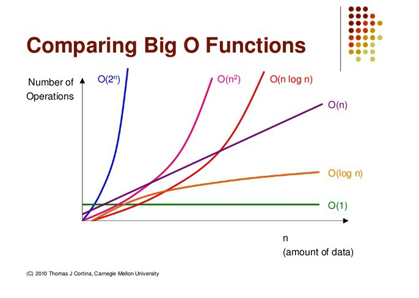
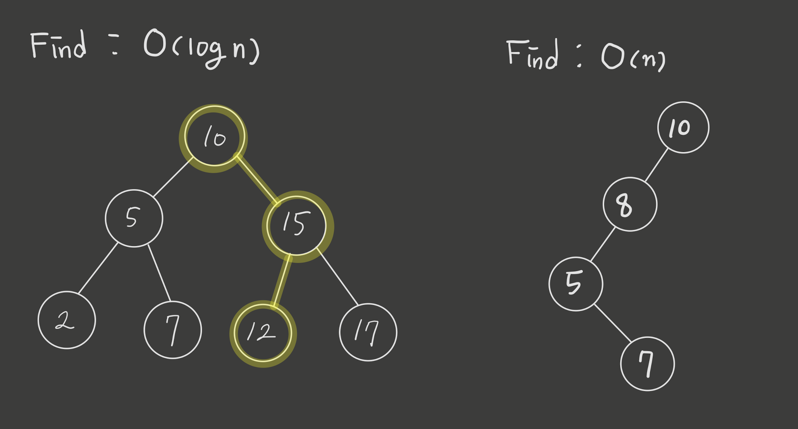

# 🔎 What is Big-O Notation?

- Big-O Notation이란 알고리즘의 효율성을 표현하는 표기법이다.
- Big-O Notation은 어떤 알고리즘이 갖고있는 시간복잡도와 공간복잡도를 나타낸다.
- 시간복잡도는 알고리즘의 시간 효율성을 말하고 공간복잡도는 메모리 효율성을 나타낸다.
- Big-O Notation으로는 다음과 같은 type들이 있다.
  - Constant Type : O(1)
  - Logarithmic Type : O(logn)
  - Linear Type : O(n)
  - Quadratic Type : O(n^2)
  - Exponential Type : O(2^n)
- Big-O 를 표기할 때는 상수는 무시한다.
- 시간복잡도의 성능을 Big-O Notations으로 비교를 하면 다음과 같다 
  **faster** O(1) < O(logn) < O(n) < O(nlogn) < O(n^2) < O(2^n) **slower**
  

# Data Structure 에 따른 Time Complexity

- Lookup : 자료구조 안에 저장공간(특정 index 또는 Node)에 어떤 data가 있는지 확인
- Assgin : 자료구조 안에 저장공간(특정 index 또는 Node)에 어떤 data를 할당
- Insert : 자료구조 안에 새로운 data를 삽입하여 저장
- Remove : 자료구조 안에 어떤 data를 삭제
- Find : 자료구조 안에 저장되어 있는 data중에 원하는 data 검색

### Array

- Lookup position: O(1)
  - 배열은 index 정보가 있으므로 index를 사용하여 해당 index에 위치한 data에 한번에 접근할수 있다.
- Assign Data : O(1)
  - 배열에 push하여 data를 넣는 작업은 배열에 순서대로 들어가는 작업이므로 한번의 작업으로 data를 넣는다.
- Insert Data : O(n)
  - 배열 중간에 data를 삽입하게 되면 기존에 있던 data기준으로 뒤에 data들은 모두 다음 index 로 옮긴다. index 0의 위치에 data를 삽입한다고 했을 때 최대 n번만큼 data가 이동해야한다.
- Remove Data : O(n)
  - remove 도 insert와 마찬가지로 어떤 data를 지우게 되면 그 data가 있던 index가 비게되고 빈 index의 공간을 채우기 위해 뒤에 data들은 다 한칸씩 index를 앞으로 옮기게 된다.
- Find Data : O(n)
  - 어떤 data를 찾고자 하고 그 data가 위치한 index를 모를 때 배열의 모든 요소를 돌면서 data를 확인해야 한다.

### Linked List

- Lookup position: O(n)
  - Linked List 는 index정보가 없기 때문에 Linked List의 Head Node를 통해서 계속 next node로 넘어가면서 확인하고자 하는 node로 이동. worst case, head 부터 tail까지 살펴봐야 하므로 O(n) 의 시간복잡도를 갖는다.
- Assign Data : O(n)
  - lookup과 마찬가지로 data를 할당할 node까지 head로 부터 이동해서 도달한 다음에 data를 해당 node에 할당해야 한다.
- Insert Data : O(1)
  - _추가하고자 하는 위치로 이동한 다음 data를 추가 할 때는_ data를 삽입하고자 하는 위치의 이전 node를 알기 때문에 next node를 새로운 data node로 연결하고 추가하는 node의 next node를 재연결하는 작업만 하면 되므로 constant type의 time complexity를 갖는다.
- Remove Data : head - O(1) / middle - O(n)
  - head node를 지울 때는 바로 삭제가 가능하지만 Singly-Linked List에서의 remove는 insert와 다르게 삭제하고자 하는 node의 이전노드를 알 수 없기 때문에 이전노드를 확인을 하고 재연결 작업을 해야 하므로 worst case O(n)의 time complexity를 갖는다.
  - 하지만 Double-Linked List에서는 어떤 node가 이전 node와 다음 node를 알기 때문에 일정한 time complexity O(1)을 갖는다.
- Find Data : O(n)
  - 어떤 data를 찾고자 할 때 그 data를 저장하고 있는 node까지 head node부터 하나씩 node를 이동하며 확인하며 찾는다.

### Tree: basic

- Find Data : O(n)

  - Tree 구조의 모든 node를 순회하며 확인해야 한다.

### Tree: Binary Search Tree

- Balanced Binary Search Tree - Find Data : O(logn)
  - 일반적인 binary search tree구조의 경우에는 그 특수성으로 인해 left or right 으로 node를 확인 할 때 다른 반대쪽 branch는 확인 할 필요가 없으므로 O(logn) 의 시간 복잡도를 갖는다.
- Unbalanced Binary Search Tree - Find Data : O(logn)
  - 하지만 branch가 한쪽으로만 계속 이어지는 unbalanced binary search tree 의 경우는 worst case 모든 node를 확인해야 하므로 O(n)의 time complexity 를 갖는다.
    
